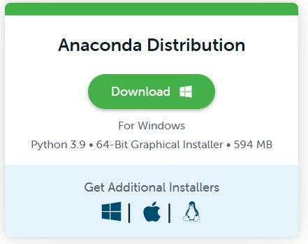

# Density Based Clustering - DBSCAN and HDBSCAN


Hello,  today we are going to cauterize a simple dataset by using DBSCAN and HDBSCAN.

1. Setup Environment
2. Basic exploratory data analysis and visualizations
3. Methods of evaluating the strength of a clustering algorithm
4. Introduction to K-Means
5. Introduction to Density-based clustering approaches, and how to use DBSCAN
6. Introduction to HDBSCAN, to alleviate constraints of classical DBSCAN
7. A simple method to address outliers classified by density-based models. 


## Step 1. Setup Environment

First you need to install anaconda at this [link](https://www.anaconda.com/products/individual)



in this location **C:\Anaconda3** , then you, check that your terminal , recognize **conda**

```
C:\conda --version
conda 23.1.0
```


The environments supported that I will consider is Python 3.10,

I will create an environment called **dbscan**, but you can put the name that you like.

```
conda create -n dbscan python==3.10
```

then we activate

```
conda activate dbscam
```

then in your terminal type the following commands:

```
conda install ipykernel notebook
```

then

```
python -m ipykernel install --user --name dbscan --display-name "Python (DBSCAN)"
```

then we install the following libraries used to the data analysis

```
pip install wget seaborn matplotlib requests tqdm
```


